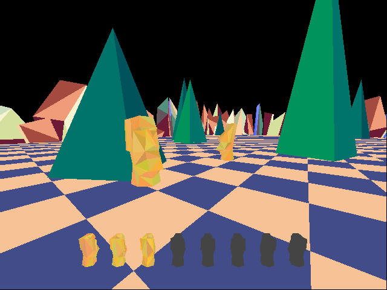
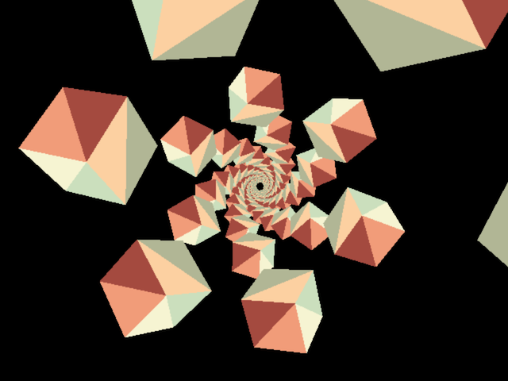
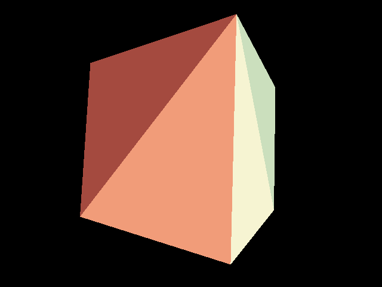

# bootleg3D

A software renderer for simple 3D graphics in a single file, written in C99. The main goal is to provide a simple API, and to keep the code base small. It might be particularly useful for retro graphics (N64, PS1, etc.) at lower resolutions with lower polygon counts. Some example programs are provided that use SDL2.




## Features

+ Triangle rasterisation (flat colour)
+ Perspective projection
+ Depth buffering
+ Clipping
+ Translation, rotation, and scaling
+ Camera position and rotation
+ Zero memory allocations
+ Only depends on math.h (sinf/cosf/tanf), stdint.h (uint32_t), and string.h (memset)
+ Single header library
+ Written in C99
+ Public domain / MIT licensed (you choose)

## API

```C
void b3d_init(uint32_t * pixel_buffer, float * depth_buffer, int w, int h, float fov);
void b3d_clear();
void b3d_reset();
void b3d_translate(float x, float y, float z);
void b3d_rotate_x(float angle);
void b3d_rotate_y(float angle);
void b3d_rotate_z(float angle);
void b3d_scale(float x, float y, float z);
void b3d_set_camera(float x, float y, float z, float xr, float yr, float zr);
void b3d_set_fov(float fov_in_degrees);
void b3d_triangle(float ax, float ay, float az, float bx, float by, float bz, float cx, float cy, float cz, uint32_t c);
```

Add `#define BOOTLEG3D_IMPLEMENTATION` before ONE of your includes to compile with the library.

## TODO
+ Draw a buffer of triangles in one call
+ More examples
+ Depth-only rendering
+ Wire-frame rendering
+ Camera utility functions
+ Make cstdlib fully optional
+ Test and ensure C++ compatibility
+ Maybe:
    - Texture mapping
    - Lighting
