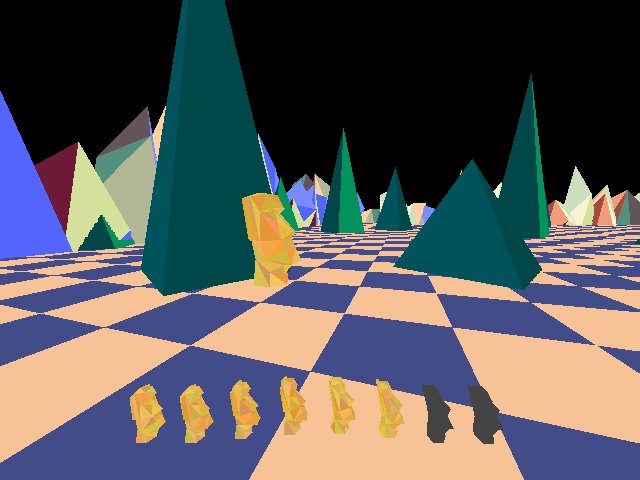

# bootleg3D

A software renderer for very simple 3D graphics, in a single file, written in C99. The main goal is to provide an easy-to-use API, and to keep the code base small. Some example programs are provided that use SDL2.



## Features

+ Triangle rasterisation (flat colour)
+ Perspective projection
+ Depth buffering
+ Clipping
+ Translation, rotation, and scaling
+ Camera position and rotation
+ Zero memory allocations
+ Only depends on math.h (sinf/cosf/tanf), stdint.h (uint32_t), and string.h (memset)
+ Single header library
+ Written in C99
+ Public domain / MIT licensed (you choose)

Add `#define BOOTLEG3D_IMPLEMENTATION` before ONE of your includes to compile with the library. \
Add `#define BOOTLEG3D_NO_CULLING` to disable back-face culling.

## API

```C
void b3d_init(uint32_t * pixel_buffer, float * depth_buffer, int w, int h, float fov);
void b3d_clear(void);
void b3d_reset(void);
void b3d_translate(float x, float y, float z);
void b3d_rotate_x(float angle);
void b3d_rotate_y(float angle);
void b3d_rotate_z(float angle);
void b3d_scale(float x, float y, float z);
void b3d_set_camera(float x, float y, float z, float yaw, float pitch, float roll);
void b3d_look_at(float x, float y, float z);
int b3d_to_screen(float x, float y, float z, int * sx, int * sy); // returns 0 if behind camera
void b3d_set_fov(float fov_in_degrees);
void b3d_triangle(float ax, float ay, float az, float bx, float by, float bz, float cx, float cy, float cz, uint32_t c);
```
